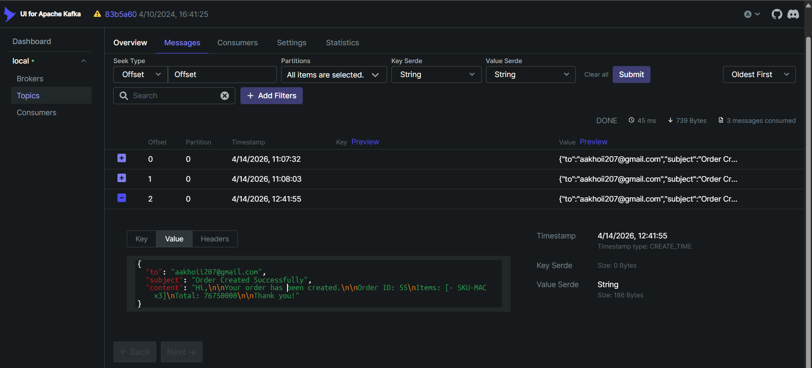

# Kafka
## 1. Definition:
- Là một message broker dùng để truyền dữ liệu giữa các service theo mô hình publish-subscribe
- Cho phép các service giao tiếp bất đồng bộ thông qua event

## 2. Refactor

| Thành phần     | OpenFeign (Trước) | Kafka (Sau) |
|----------------|------------------|------------|
| Gửi email      | `feignClient.sendEmail()` | `kafkaTemplate.send()` |
| Nhận request   | `@RestController` | `@KafkaListener` |
| Kiểu giao tiếp | HTTP API | Message/Event |
| Payload        | DTO request | Event (JSON) |
| Config         | Feign config | Kafka producer/consumer config |
| Dependency     | `spring-cloud-openfeign` | `spring-kafka` |

## 3. Flow Open feign:
```
User → Order Service → (Feign HTTP call) → Notification Service → Send Email → Response
```
- Order-service gọi API trực tiếp
- Phải chờ notification-service xử lý xong
- Sau đó mới trả response về cho user

## 4. Flow Kafka:
```
User → Order Service → (Publish Event) → Kafka → Notification Service (Consumer) → Send Email
```
- order-service publish 1 event lên Kafka -> trả về response ngay
- notification-service lắng nghe event và gửi email (xử lý độc lập/ bất đồng bộ)

## 5. Step by step
### 1. docker-compose.yml
- Thêm các container về kafka và kafka-ui

### 2. Loại bỏ Open feign
- order-service: client, ApplicationEventPublisher
- notification-service: internal api

### 3. Thêm dependency kafka cho cả 2 service

### 4. Cấu hình application cho từng service
- order: producer
- notification: consumer

### 5. Tạo event object để làm payload
- Loại bỏ DTO HTTP của Open feign
- Tạo event tương ứng cho 2 service
```
public class OrderCreatedEvent {
    private String orderId;
    private String email;
    private String message;
}
```

### 6. Publish event lên kafka topic

### 7. Khi có event, sẽ scan toàn bộ hệ thống
- Tìm đến **@KafkaListener**
- Truyền dữ liệu thông qua payload vào request của notification và thực hiện gửi email

### 8. Mở kafka-ui kiểm tra message topic và check gmail

