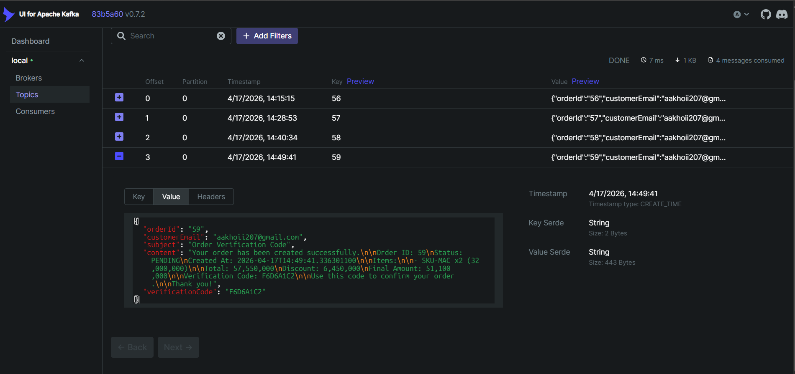

# Kafka

## 1. Definition:
- Là một message broker dùng để truyền dữ liệu giữa các service theo mô hình publish-subscribe
- Cho phép các service giao tiếp bất đồng bộ thông qua event

---

## 2. Refactor

| Thành phần     | OpenFeign (Trước)                  | Kafka (Sau)                  |
|----------------|-----------------------------------|------------------------------|
| Gửi email      | `feignClient.sendNotification()`  | `kafkaTemplate.send()`       |
| Nhận request   | `@RestController`                | `@KafkaListener`             |
| Kiểu giao tiếp | HTTP API                         | Message/Event                |
| Payload        | DTO request                      | Event (JSON)                 |
| Config         | Feign config                     | Kafka producer/consumer config |
| Dependency     | `spring-cloud-openfeign`         | `spring-kafka`               |

---

## 3. Step by step

1. Tạo docker-compose.yml (Kafka + Zookeeper hoặc KRaft)
2. Thêm dependency Kafka (spring-kafka)
3. Config application.yml (producer + consumer)
4. Tạo event (NotificationMessage)
5. Publish event (NotificationProducer)
6. Consume event (@KafkaListener)
7. Check message bằng Kafka UI

---

## 4. Flow Hybrid (Feign + Kafka)

User  
→ Order Service  
→ Feign (HTTP call)  
→ Notification Service  
→ Kafka (publish event)  
→ Consumer  
→ Send Email

---

## 5. Verification Code Flow

- Generate verificationCode (8 ký tự random)
- Trả về cho client trong OrderResponse
- Gửi qua email
- User dùng code để verify

---

## 6. Event Payload

```
{
    "orderId": "123",
    "customerEmail": "user@gmail.com",
    "subject": "Order Verification Code",
    "content": "Your order has been created...",
    "verificationCode": "ABCD1234"
}
```

---

## 7. Kafka Topic

order.notification

---

## 8. Consumer Group

@KafkaListener(
topics = "order.notification",
groupId = "notification-group"
)

---

## 9. Full Flow (Thực tế đang dùng)

### Bước 1: Client gửi request

POST /api/orders  
→ OrderController nhận request  
→ gọi: orderCommandService.createOrder(request)

---

### Bước 2: OrderCommandServiceImpl

- Tìm customer → CustomerRepository
- Tính giá → PricingService
- Tính discount → DiscountCalculationService
- Validate discount
- Generate verificationCode
- Lưu order → OrderRepository
- Trả OrderResponse
- Gọi sendOrderNotification()

---

### Bước 3: Feign call

NotificationClient.sendNotification(request)  
→ POST /api/notifications/send

---

### Bước 4: NotificationController

- Nhận request
- Gọi notificationService.sendOrderNotification()

---

### Bước 5: NotificationServiceImpl

- Không gửi mail trực tiếp
- Build NotificationMessage
- Gửi vào Kafka

notificationProducer.send(message);

---

### Bước 6: Kafka Producer

- Topic: order.notification
- Key: orderId
- Value: JSON message

---

### Bước 7: Kafka Consumer

```
@KafkaListener(topics = "order.notification", groupId = "notification-group")
  public void consume(NotificationMessage message) {
    try {
      SimpleMailMessage mail = new SimpleMailMessage();
      mail.setTo(message.getCustomerEmail());
      mail.setSubject(message.getSubject());
      mail.setText(message.getContent());
      mailSender.send(mail);
      log.info("[KafkaConsumer] Email sent to={} orderId={}",
          message.getCustomerEmail(), message.getOrderId());
    } catch (Exception e) {
      log.error("[KafkaConsumer] Failed to send email orderId={}: {}",
          message.getOrderId(), e.getMessage());
    }
  }
```

→ Gửi mail qua SMTP (Gmail)

---
### Bước 8: Check kafka-ui


